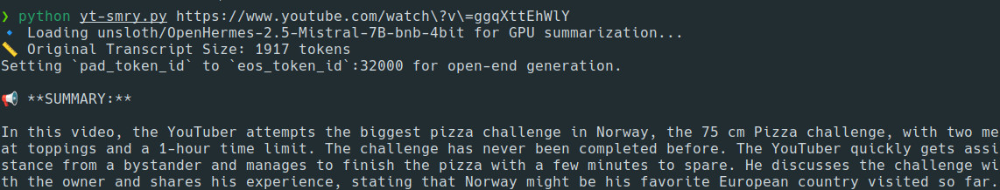

# yt-smry

Generate YouTube video text summaries directly on your local machine—completely free, no API keys required. No signups, no fees—just your own hardware doing the work!



## Installation

1. **Clone this repository**:
   ```bash
   git clone https://github.com/stukev/yt-smry.git
   cd yt-smry
   ```
2. **Create and activate a Python virtual environment**:
   ```bash
   python -m venv .venv
   source .venv/bin/activate  # On Windows: .\.venv\Scripts\activate
   ```
3. **Install required packages**:
   ```bash
   pip install -r requirements.txt
   ```

## Usage

Activate your virtual environment (if not already active):
```bash
source .venv/bin/activate
```

For interactive mode run:
```bash
python yt-smry.py
```

For CLI mode run:
```bash
python yt-smry.py <YouTube_URL> [options]
```

**Command line arguments**:

- `--level {short|medium|long}`
  - Controls final summary length. Defaults to `medium`.
- `--truncate`
  - Uses a TextRank-based truncation before summarizing. Faster but can lose details.
- `--verbose`
  - Prints additional information about resource checks and processing steps.

**CLI examples**:
1. **Default**:
   ```bash
   python yt-smry.py "https://www.youtube.com/watch?v=some_video_id"
   ```
2. **Short summary**:
   ```bash
   python yt-smry.py "https://www.youtube.com/watch?v=some_video_id" --level short
   ```
3. **Truncated approach (for CPU mode)**:
   ```bash
   python yt-smry.py "https://www.youtube.com/watch?v=some_video_id" --truncate
   ```
4. **Verbose mode (for debugging)**:
   ```bash
   python yt-smry.py "https://www.youtube.com/watch?v=some_video_id" --verbose
   ```

## How It Works

1. **Subtitles Download**  
   Uses `yt-dlp` to fetch and cache English subtitles from YouTube.
2. **Cleaning**  
   Removes timestamps, numeric labels, and duplicate lines from the downloaded subtitles.
3. **Summarization (CPU)**  
   - If `--truncate` is used, the text is first shortened with **TextRank**, then summarized with **BART** (`facebook/bart-large-cnn`).
   - Otherwise (default), a **chunked BART** approach processes the transcript in segments to preserve coverage, then condenses it to short/medium/long.
4. **Summarization (GPU)**  
   If enough VRAM is available (≥ 5 GB), the script attempts to load **Mistral 7B (4-bit)** for highest-quality summaries. If VRAM is low but system RAM ≥ 16 GB, it falls back to CPU.
5. **Chunking vs. Truncating**  
   - **Chunking** splits the entire transcript into sections that fit BART/Mistral’s token limit. This avoids discarding any parts of the transcript. A final pass then compresses everything to the desired length.
   - **Truncation** uses TextRank to extract key sentences before performing a single summarization pass. Faster, but may lose detail.

## Limitations

- Currently only tested on Nvidia cards and on Linux.
- Currently only supports English subtitles.

Feel free to open a ticket with details if you try a different configuration.

## Acknowledgments

- This project uses the **Mistral 7B (4-bit)** model from [unsloth](https://github.com/unslothai/unsloth).
- Thanks to the `yt-dlp` community for the subtitle extraction functionality.
- BART model courtesy of [Facebook Research](https://github.com/facebookresearch).

